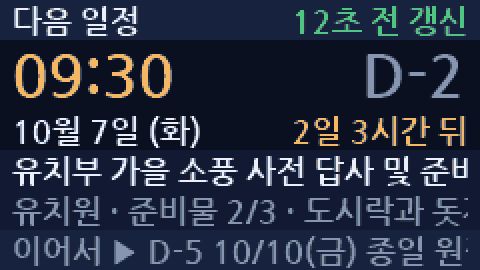

# GodlifeScheduleNext — 하루동행 다음 일정 표시기

TTGO T-Display(240×135)에 **하루동행(godlife) 다음 일정**을 띄운다.
칸을 넘치는 제목·메모·이어지는 일정은 **마퀴로 흘려서** 끝까지 읽히게 한다.



## 가져오는 곳

```
GET https://jesusdream.kr/api/godlife/schedule/next?days=30&limit=3
```

jdServer 의 `godlife/GodlifeManager.js` 가 Firebase RTDB 를 읽어 돌려준다.

```jsonc
{
  "next": {
    "title": "유치부 가을 소풍 사전 답사",
    "institutionLabel": "유치원",
    "date": "2026-10-07", "weekday": "화", "time": "09:30", "isAllDay": false,
    "memo": "도시락 챙기기", "dDay": 2, "minutesUntil": 3060,
    "preparations": [ { "text": "돗자리", "checked": true } ]
  },
  "following": [ /* 같은 모양 3건 */ ]
}
```

주소를 바꾸려면 `ChurchSecrets.h` 에 한 줄 넣으면 된다(스케치의 기본값보다 우선한다).

```cpp
#define GODLIFE_API_BASE "http://192.168.0.2:8000/api/godlife"
#define GODLIFE_OWNER    "someone@example.com"   // 없으면 서버 기본 계정
```

> **라우터가 없는 서버는 200 으로 SPA 의 `index.html` 을 돌려준다.** 그리고
> **필터를 건 `deserializeJson` 은 그걸 오류로 잡아 주지 않는다** — 필터에 안 맞는
> 입력은 건너뛰기만 해서, HTML 을 먹여도 "빈 문서 + 성공" 으로 끝난다(배포 전에
> 실기에서 "일정 0건" 으로 나와 알았다). 그래서 파싱 전에 `Content-Type` 을 보고,
> 파싱 뒤에 서버가 늘 주는 `days` 필드로 응답 모양을 한 번 더 확인한다.
> 아니면 화면에 "JSON 이 아님" · "응답 형식 오류" 가 뜬다.

## 화면

```
┌───────────────────────────────────────────┐
│ 다음 일정                    12초 전 갱신 │  상태 띠
│  09:30                              D-2   │  큰 시각 (종일이면 10.07)
│ 10월 7일 (화)              2일 3시간 뒤   │  날짜 / 남은 시간
│ 유치부 가을 소풍 사전 답사 및 준비 모…    │  제목      ← 넘치면 흐름
│ 유치원 · 준비물 2/3 · 도시락과 돗자리…    │  기관·준비물·메모 ← 넘치면 흐름
│ 이어서 ▶ D-5 10/10(금) 종일 원장 면담…   │  이어지는 일정   ← 넘치면 흐름
└───────────────────────────────────────────┘
```

남은 시간은 화면에서 1초마다 다시 계산한다(서버가 준 `minutesUntil` 에서 그동안
흐른 시간을 뺀다). 5분마다 다시 불러오고, 실패하면 20초 뒤 다시 시도한다.

## 조작

| 버튼 | 하는 일 |
|------|---------|
| 위(GPIO35) | 다음 일정 → 그다음 → … → 목록 화면 → 처음으로 |
| 아래(GPIO0) | 지금 바로 새로고침 |

| 터치(GPIO32) | 꺼진 화면을 켠다. 켜져 있으면 화면 끄기까지의 5분을 다시 센다 |

**화면이 꺼져 있을 때의 첫 눌림은 켜기로만 쓴다.** 불을 켜려던 손짓이 일정을
넘기거나 새로고침을 돌리지 않도록 그 한 번은 삼킨다.

## 터치로 화면 깨우기

T-Display 화면에는 터치 패널이 없다. 대신 ESP32 의 **정전식 터치 핀 T9(GPIO32)** 을 쓴다.
헤더의 `32` 번 핀에 **구리 테이프 · 금속판 · 짧은 전선**을 이으면 끝이다(다른 부품 없음).
케이스 안쪽에 붙인 테이프도 얇은 플라스틱(1~3mm) 너머로 잡힌다.

- 켤 때 8번 읽어 **기준값**을 잡는다. 켜는 순간에는 손을 대지 않는다.
- 기준보다 `TOUCH_DROP_PCT`(15%) 이상 떨어진 값이 **두 번 연달아**(약 0.2초) 읽히면 터치다.
  떼었다고 보는 문턱은 그 절반(7%)이라 경계에서 떨지 않는다.
- 대지 않을 때는 기준값이 천천히 따라간다(온도·습기).
- **5초 넘게 계속 낮으면 그 값을 새 기준으로 잡는다.** 켜진 채로 전선·테이프를 붙이면
  값이 내려앉아 '계속 대고 있음' 으로 굳는데, 그걸 풀어 준다.
- 100ms 마다 한 번(1회 약 0.5ms) 읽으므로 부하는 거의 없다.

| 값 | 기본 | 뜻 |
|----|------|-----|
| `TOUCH_PIN` | 32 | 터치 핀. 33(T8)·27(T7)·15(T3)·13(T4) 도 비어 있다 |
| `TOUCH_DROP_PCT` | 15 % | 저절로 켜지면 올리고, 대도 안 켜지면 내린다 |
| `TOUCH_LOG` | false | true 면 2초마다 `[터치] 값 · 기준 · 문턱` 을 찍는다 — 감도 맞출 때 |

실기(아무것도 안 붙인 핀, USB 급전)에서 기준값 **1977**, 흔들림 **±15(1% 안쪽)** 였다.
전선은 짧게(20~30cm 안쪽) — 길면 잡음이 늘어 저절로 켜질 수 있다.

## 마퀴

줄마다 글 폭을 재서 **칸을 넘칠 때만** 흐른다. 짧은 줄은 가만히 있는다.

| 값 | 기본 | 뜻 |
|----|------|-----|
| `MARQ_SPEED` | 34 px/s | 흐르는 속도 |
| `MARQ_GAP` | 44 px | 한 바퀴와 다음 바퀴 사이 여백 |
| `MARQ_HOLD` | 1400 ms | 시작할 때·한 바퀴 돌 때마다 멈춰 있는 시간 |
| `MARQ_ROUNDS` | 3 바퀴 | 이만큼 돌면 앞으로 돌아가 멈춰 선다 |

**영영 흐르지는 않는다.** 흐르는 줄 하나가 30fps 로 줄 스프라이트를 계속 밀어
넣기 때문에(240×20×2B = 9.6KB/프레임) 다 읽을 만큼 돌면 세운다. 새로 받아오거나
(5분) 버튼을 누르면 `dirtyAll` → `resetMarquees()` 로 처음부터 다시 흐른다.

글을 한 번 그리고 여백만큼 띄워 **한 번 더** 그리기 때문에 이어짐이 끊기지 않는다.
넘치는 글자는 뷰포트가 잘라내므로 옆 칸을 침범하지 않는다.

깜빡임을 없애려고 화면에 직접 쓰지 않고 **240×20 줄 스프라이트**에 그려서 통째로
밀어 넣는다. 그래서 한글 폰트는 `tft` 가 아니라 이 스프라이트에 올라가 있고,
줄 띠(`Y_TOP`·`Y_BIG`·`Y_META`·`Y_TITLE`·`Y_MEMO`·`Y_FOOT`)는 **서로 겹치면 안 된다** —
겹치면 나중에 그린 줄이 옆 줄을 지운다.

## 전력

처음엔 **150~170mA** 를 먹었다. 원인이 네 군데였고 넷 다 고쳐 **45~60mA** 로 내렸다.

| 손잡이 | 기본 | 뜻 |
|--------|------|-----|
| `WiFi.setSleep(true)` | 켬 | 모뎀 슬립. 껐을 때 RF 수신단이 상시 켜져 100mA 대를 먹었다 |
| `CPU_MHZ` | 80 | WiFi 가 요구하는 하한. 240MHz 는 이 화면에 과하다 |
| `BL_DUTY_ON` | 150 / 255 | 백라이트 밝기(약 60%) |
| `BL_IDLE_MS` | 5분 | 이만큼 버튼이 없으면 화면을 끈다 (`0` 이면 끄지 않는다) |
| `MARQ_ROUNDS` | 3 | 마퀴가 이만큼 돌면 멈춘다 |

그리고 `loop()` 끝의 `delay()`. 이게 없으면 `loopTask` 가 CPU 를 놓지 않아 idle
태스크가 돌지 못하고, CPU 가 `WAITI`(클럭 게이팅)로 내려가지 못한다.

**모뎀 슬립을 켜도 이 기기는 느려지지 않는다.** 서버가 밀어 주는 것이 없고 5분마다
이쪽에서 GET 을 거는 구조라, 늦어지는 것은 수신 지연뿐이다.

화면을 끌 때는 백라이트 듀티를 0 으로 내리고 패널에 `DISPOFF`(0x28)를 보낸다.
WiFi 와 5분 폴링은 그대로 돌기 때문에, 깨우면 최신 일정이 이미 들어와 있다.
아주 끄지 말고 어둡게만 두려면 `screenSleepIfIdle()` 의 `backlightSet(0)` 을
`backlightSet(20)` 쯤으로 바꾸면 된다.

## 폰트

```bash
./tools/make-fonts.sh          # FontKR16.h · FontNum30.h 생성 (저장소에 없다)
```

| 파일 | 크기 | 담긴 글자 |
|------|------|-----------|
| `FontKR16.h` | 591KB | 16px, KS X 1001 상용 한글 2,350자 + ASCII + `· ▶ ● ○ ◆ … —` |
| `FontNum30.h` | 6KB | 30px, `0-9 : . - D A Y` (큰 시각·D-day 전용) |

**여기만 음절 전체(11,172자)를 쓰지 않는다.** TFT_eSPI 는 글리프 메트릭을 RAM 에
올리는데(글리프당 12B) 전체면 135KB 라 HTTPS 핸드셰이크가 쓸 힙이 남지 않는다.
상용 2,350자면 29KB 로 끝난다. 대신 "뷁" 같은 상용 밖 음절은 네모로 그려진다.

폰트에 없는 기호도 네모가 된다. 나눔고딕볼드에 `▸`(U+25B8)는 **없고** `▶`(U+25B6)는
있다 — 문구에 기호를 넣을 땐 `--chars` 에 함께 넣고 폰트를 다시 만들 것.

서버가 주는 글에는 이모지가 섞여 온다(실제 응답에 `후문 하차❤️` 가 있었다). 그대로
두면 네모가 되므로 `copyUtf8Font()` 가 **폰트에 구워 넣은 글자만 남기고 버린다** —
ASCII · 한글 음절 · `--chars` 로 넣은 기호. 상용 2,350자 밖 음절은 여전히 네모다.

## 빌드

`sketch.yaml` 에 FQBN(Huge APP 3MB)과 포트가 들어 있어 그냥 부르면 된다.

```bash
arduino-cli compile GodlifeScheduleNext
arduino-cli compile --upload GodlifeScheduleNext
```

**업로드가 `Unable to verify flash chip connection` 으로 실패하면** 921600 보드레이트를
USB 칩이 못 버티는 것이다. 속도를 낮춰 올린다:

```bash
arduino-cli compile --upload GodlifeScheduleNext -b esp32:esp32:esp32:PartitionScheme=huge_app,UploadSpeed=460800
```

TFT_eSPI 는 `Setup25_TTGO_T_Display.h` 활성화가 필요하다 — [docs/TFT_eSPI_setup.md](../docs/TFT_eSPI_setup.md)

플래시 1.71MB(54%) · 전역 53KB. 폰트 29KB + 스프라이트 26KB 를 뺀 힙으로 TLS 를 한다.

## 미리보기 만들기

실기 없이 배치와 마퀴를 확인하려면:

```bash
python3 tools/preview_godlife.py
```

스케치와 같은 좌표·색·폰트로 `preview/godlife_main.png` 와
`preview/godlife_marquee.gif` 를 만든다. 어느 줄이 넘쳐서 흐르는지도 같이 찍어 준다.

## 실기에서 확인한 것

TTGO T-Display 에 구워서(1,707,764B, 해시 검증) 돌렸다. **전력 절감분이 들어가기
전의 판이다** — 아래 항목은 그때 확인한 것이고, 전력 쪽은 아직 실기 계측 전이다.

- 부팅 → WiFi 접속 → HTTPS 조회 → 파싱까지 실제 서버 응답으로 동작한다
  (`[요청] 일정 4건  다음=미니캠프`)
- 요청 시점 **여유 힙 154KB** — 폰트(29KB)와 스프라이트(26KB)를 올린 뒤에도 TLS 가 넉넉하다
- 라우터 배포 전에는 SPA 가 돌아와서 위의 필터 문제를 찾아냈다

시리얼 모니터를 열면 **DTR/RTS 가 GPIO0 을 건드려 아래 버튼(새로고침)이 눌린 것처럼
동작한다.** 로그를 볼 때마다 새로고침이 한 번 도는데, 평소 사용에는 영향이 없다.

## 아직 확인하지 못한 것

- 화면 실물 — 배치·마퀴는 호스트 미리보기로만 봤다
- **전력 절감분 전체** — 컴파일만 확인했다(1,717,107B · 54%, 전역 53,596B).
  전류계로 재 보고, 특히 `DISPOFF`(0x28) 뒤에 다시 `DISPON`(0x29) 으로 멀쩡히
  돌아오는지, 80MHz 에서 TLS 핸드셰이크가 8초 타임아웃 안에 끝나는지 볼 것
- 스프라이트를 밀어 넣는 속도(30fps 로 돌린다. 느리면 `loop()` 의 33ms 를 늘릴 것)
