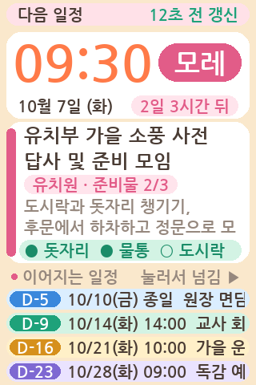
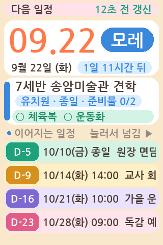
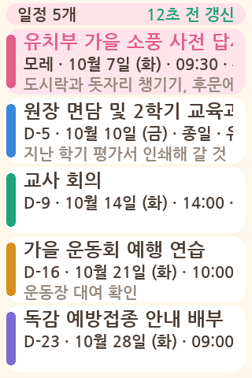

# GodlifeScheduleNext_JC3248 — 가이션 JC3248W535 판 하루동행 일정 표시기

[`../GodlifeScheduleNext`](../GodlifeScheduleNext/README.md) 를 **화면·터치가 한 판에
붙어 나오는 기성품 보드**로 옮긴 것이다. 가져오는 곳과 하는 일은 원본과 같으므로
동작 설명은 [원본 README](../GodlifeScheduleNext/README.md) 를 본다. 이 문서는 **다른 점만** 적는다.



| | 원본 GodlifeScheduleNext | 이 폴더 |
|---|---|---|
| 보드 | TTGO T-Display (ESP32) | JC3248W535C_I_Y (ESP32-S3-WROOM-1 N16R8) |
| 화면 | 1.14" 240×135 ST7789 (SPI) | 3.5" 320×480 IPS AXS15231B (QSPI, 붙박이) |
| 그리는 라이브러리 | TFT_eSPI + 줄 스프라이트 | Arduino_GFX + 이 폴더의 껍데기(통짜 버퍼) |
| 입력 | 단추 둘 + 터치 핀(T9)에 구리 테이프 | 정전식 터치 화면 (보정 없음) |
| 한 화면에 드는 일정 | 다음 1건 + 이어지는 일정 한 줄 | 다음 1건(펼쳐서) + 이어지는 4건(줄마다) |
| 폰트 | 한글 16px · 숫자 30px | 한글 20/24px · 숫자 34/64px |
| 생김새 | 검은 바탕에 글만 | 크림빛 바탕 · 둥근 카드 · 크레용 색 (유치원 알림판) |
| 손으로 잇는 것 | 터치용 구리 테이프(선택) | 없다 — USB 만 꽂는다 |
| 파티션 | Huge APP(3MB) | 앱 4MB 짜리 custom 표 (`partitions.csv`) |

## 내용이 훨씬 많이 보인다

픽셀이 열 배다(32,400 → 153,600). 원본이 한 줄에 못 담아 마퀴로 흘리던 것을
여기서는 대부분 펼쳐 놓는다.

```
  ( 크림빛 도화지 · 둥근 흰 카드 · 일정마다 제 크레용 색 )
 ╭──────────────────────────────────╮ 320×480
 │(다음 일정          12초 전 갱신 )│ 상태 알약 (누르면 새로고침)
 ╭──────────────────────────────────╮
 │ 09:30                    ( 모레 )│ 큰 시각 64px / D-day 알약 34px
 │ 10월 7일 (화)   (2일 3시간 뒤 )  │ 날짜 / 남은 시간 알약
 ╰──────────────────────────────────╯
 ╭┰─────────────────────────────────╮
 │┃유치부 가을 소풍 사전 답사       │ 제목 — 두 줄로 접는다 (24px)
 │┃및 준비 모임                     │ ┃ 왼쪽 띠가 이 일정의 크레용 색
 │┃(유치원 · 준비물 2/3)            │ 기관 · 종일 · 준비물 개수 — 딱지
 │┃도시락과 돗자리 챙기기, 후문에서 │ 메모 — 두 줄로 접는다
 │┃하차하고 정문으로 모일 것        │ 빈 줄은 접는다 → 카드가 줄어든다
 │┃[● 돗자리  ● 물통  ○ 도시락]     │ 준비물 이름 — 연민트 띠 위에
 ╰┸─────────────────────────────────╯
 ● 이어지는 일정     눌러서 넘김 ▶
 (D-5   10/10(금) 종일  원장 면담 )│ 이어지는 일정 — 일정마다 제 딱지
 (D-9   10/14(화) 14:00 교사 회의 )│ 딱지 색이 그 일정의 크레용 색이다
 (D-16  10/21(화) 10:00 운동회 …  )│ 넘치는 줄만 흐른다
 (D-23  10/28(화) 09:00 예방접종 …)│
 ╰──────────────────────────────────╯
```

## 생김새 — 크레용 상자

유치원 일정표라서 **글자 크기 대신 색과 모양으로** 꾸몄다. VLW 는 구운 크기로만
그려져 크기를 하나 늘릴 때마다 플래시를 한 벌씩 더 먹는다(한글 한 벌이 1MB 언저리).
그래서 **글자 크기는 네 가지가 전부다** — 본문 20px · 제목 24px · D-day 34px ·
큰 시각 64px. 꾸밈은 전부 둥근 네모와 색으로 한다. 플래시는 한 바이트도 더 들지 않는다.

- **크레용 다섯 자루** — 분홍 · 하늘 · 민트 · 레몬 · 라일락. 일정마다 한 자루씩
  돌아가며 물든다. 카드 왼쪽 띠 · D-day 알약 · 이어지는 일정 딱지 · 목록에서 고른
  카드가 같은 색이라, **색만 보고도 아까 보던 일정인지 안다.** 오늘인 일정만은
  알약이 빨강이다.
- **D-day 를 말로 적는다** — "D-2" 대신 `오늘 · 내일 · 모레 · D-5`. 34px 숫자 폰트에
  한글 여섯 자(오늘내일모레)를 같이 구웠다. 6KB 늘었다.
- **준비물 줄에 연민트 띠** — 개수(2/3)는 제목 아래 딱지에, 이름은 이 띠 위에 적는다.
- **빈 줄은 접는다** — 제목이 한 줄로 끝나거나 메모가 없는 일정이 흔하다. 자리를
  고정해 두면 그만큼 흰 칸이 남아서, 없는 줄은 건너뛰고 카드를 줄인다(`layout()`).
  줄어든 만큼 이어지는 일정이 위로 올라붙고 **딱지가 도톰해진다**(30→최대 46px) —
  누르기도 그만큼 쉬워진다. 줄이 다 찬 일정은 예전과 똑같은 자리다.
- **둥근 네모는 `Box` 하나로 적는다**(`ScheduleTypes.h`). 카드처럼 여러 줄에 걸친
  것도 그대로 적어 줄마다 같이 넘기면, 줄을 그릴 때 **그 줄 몫만 잘려 칠해져서**
  이어 붙으면 한 장이 된다(`drawRow` 의 자를 칸). 줄 단위로만 다시 그리는 구조를
  그대로 두고 카드를 얹는 방법이다.

줄이 적은 일정은 이렇게 접힌다 — 카드가 짧아지고 딱지가 도톰해진다.



목록 화면(`SCR_LIST`)도 한 줄이 아니라 **일정마다 세 줄**(제목·때·메모)로 적는다.



### 접기와 마퀴

원본은 넘치는 줄을 전부 흘렸다. 여기서는 **먼저 접고, 접고도 넘치면 그때 흘린다.**

- 제목·메모는 두 줄로 접는다. 첫 줄은 폭에 맞춰 끊고(띄어쓰기가 있으면 거기서,
  없으면 글자 경계에서), 둘째 줄에 남은 글을 통째로 둔다 — 둘째 줄이 넘치면 그 줄만 흐른다.
- 접는 일은 **글이 바뀔 때만** 한다(`buildLines`). 폭을 재는 일이 글자 수만큼
  반복되므로 매 프레임 하면 비싸다. 30fps 로 도는 것은 마퀴뿐이다.
- 마퀴 손잡이(`MARQ_SPEED`·`MARQ_GAP`·`MARQ_HOLD`·`MARQ_ROUNDS`)는 원본과 같다.
  세 바퀴 돌면 앞을 보인 채 멈춘다.

## 조작 — 단추가 없다. 화면을 누른다

| 누른 곳 | 하는 일 |
|---------|---------|
| 위쪽 상태 띠 | 지금 바로 새로고침 (원본의 아래 단추) |
| 이어지는 일정 딱지 | **그 일정으로 바로 건너뛴다** (원본에 없던 것 — 좌표가 있어 생겼다) |
| 그 밖 아무 곳 | 다음 일정 → 그다음 → … → 목록 화면 → 처음으로 (원본의 위 단추) |
| 꺼진 화면 | 첫 눌림은 켜기로만 쓴다 — 그 한 번은 삼킨다 |

터치 칩(AXS15231B)은 새 좌표가 없는 틈에 **헛값**을 준다. 그대로 읽으면 한 번 누름이
여러 번으로 세어진다 — 껍데기(`PanelTFT::getTouch`)가 헛값을 '새 소식 없음' 으로 보고
마지막 유효 좌표 뒤 60ms 동안은 누른 채로 친다. 본체는 거기에 더해 **누르기 시작한
한 번**만 세고 250ms 잠근다.

## 배선

화면·터치·백라이트가 보드 안에 붙박이라 **손댈 것이 없다.** USB 만 꽂으면 된다.
(원본과 달리 터치용 구리 테이프도 필요 없다 — 진짜 터치 패널이 붙어 있다.)

### 보드가 쓰고 있는 핀 (건드리지 말 것)

| 핀 | 쓰임 |
|----|------|
| 45 · 47 · 21 · 48 · 40 · 39 | 화면 QSPI (CS · SCK · D0~D3) |
| 1 | 백라이트 (PWM) |
| 4 · 8 | 터치 I2C (SDA · SCL, 주소 0x3B) |
| 3 | 터치 INT |

**내장 LED 코드를 켜면 안 된다.** 코어의 esp32s3 변형이 `RGB_BUILTIN` 을 GPIO48 로 두는데
이 보드에서 48번은 화면 QSPI 의 데이터선(D1)이다. 이 스케치는 LED 를 잡지 않는다.

**C to C 케이블로는 맥에 안 잡힌다.** 보드의 Type-C 에 CC 저항이 없어 **A to C 케이블**이라야 한다.

## 화면을 어떻게 그리는가

이 보드의 패널은 QSPI 라 **TFT_eSPI 가 다루지 못한다.** 그리는 일은 Arduino_GFX 가 맡고,
본체가 부르는 `tft.*` 는 같은 이름의 껍데기가 받는다 — `TalentNfcReader_JC3245` 와 같은 방식이다.

| 파일 | 하는 일 |
|------|---------|
| `PanelTFT.h/.cpp` | `tft.*` 를 Arduino_GFX 로 옮겨 준다. 터치(I2C)도 여기서 읽는다 |
| `PanelTFT::beginPaint/endPaint` | 한 프레임을 묶는다 — 다 그려진 뒤에야 화면으로 나간다 |
| `VlwFont.h/.cpp` | 한글 스무스폰트(VLW)를 직접 읽어 글자를 그린다 (JC3245 판과 같은 파일) |

320×480 버퍼(PSRAM 300KB)에 다 그린 뒤 33ms 마다 도는 전용 태스크가 통째로 민다.

### 줄 스프라이트가 없다

원본이 240×20 줄 스프라이트를 둔 까닭은 **깜빡임**이었다. 화면에 직접 쓰면 마퀴가
매 프레임 배경을 지웠다 그리느라 깜빡인다. 이 보드는 한 프레임을 버퍼에 다 그린 뒤에야
화면으로 나가므로 애초에 깜빡이지 않는다 — 그 장치가 필요 없어졌다.

다만 **반쯤 그려진 프레임은 밀면 안 된다.** 줄 하나를 고쳐 그리는 동안 버퍼에는
바탕만 깔리고 글자가 아직 없는 순간이 있는데, 그때 밀리면 그 줄이 빈 채로 한 프레임
나간다. 흐르는 마퀴는 그 줄을 초당 서른 번 고쳐 그리므로 그 틈이 자주 걸려 **글자가
깜빡이는 것처럼 보인다** — 실기에서 그렇게 드러났다. 카드를 얹으면서 빈 틈이
길어진 탓이다(바탕 지우기 → 둥근 네모 두셋 → 글자).
→ 한 프레임을 `beginPaint()`/`endPaint()` 로 묶고, 미는 태스크가 그 사이에는
기다리게 했다. 자물쇠를 잡는 차례는 어디서나 **그림 → 버스** 로 같게 둔다.

대신 마퀴가 넘치는 글자를 옆 칸에 흘리지 않게 **자를 칸**이 필요하다. 원본은
스프라이트의 뷰포트로 했고, 여기서는 껍데기에 `setClip()` 을 더해 그 자리를 메웠다.

자를 칸은 둥근 카드에도 쓰인다. 그래서 `fillRoundRect` 는 Arduino_GFX 것을 부르지
않고 가로줄로 직접 칠한다 — 그쪽은 우리 자를 칸을 모르기 때문이다. 칠하는 일을
모두 `fillRect` 로 넘겨 자를 칸이 지켜지게 했다.

### 폰트

| 폰트 | 어디에 |
|------|--------|
| `FontKR20` (2,350자 · 918KB) | 본문·메모·목록·이어지는 일정 |
| `FontKR24` (2,350자 · 1.26MB) | 제목 |
| `FontNum34` (23자 · 13.5KB) | D-day 알약 — 숫자에 `오늘 내일 모레` 여섯 자를 더 구웠다 |
| `FontNum64` (17자 · 26.7KB) | 큰 시각 — "09:30" 이 175px |

숫자 폰트의 글자 집합이 달란트 리더의 것과 다르다 — 시각의 `:` 와 D-day 말이 필요하다.
메트릭은 PSRAM 에 올라간다(글리프당 12B × 2,452 × 두 벌 ≈ 59KB) — 원본과 달리 힙을
아끼려고 글자 수를 줄일 이유가 없다. 다만 **플래시**는 한글 두 벌이 2.2MB 라
앱 칸 4MB 에 들어가는 한계에 가깝다. 더 키우려면 `partitions.csv` 부터 손볼 것.

## 빌드

```bash
./GodlifeScheduleNext_JC3248/build.sh            # 컴파일
./GodlifeScheduleNext_JC3248/build.sh --upload   # 컴파일 + 업로드
```

**PSRAM(opi)을 반드시 켜야 한다** — 화면 버퍼 300KB 와 폰트 메트릭을 거기에 잡는다.
build.sh 의 FQBN 에 들어 있다.

```bash
arduino-cli lib install "GFX Library for Arduino" "ArduinoJson"
```

폰트 헤더는 저장소에 없다(파생 파일). 클론 직후 한 번 만든다:

```bash
./tools/make-fonts.sh
```

현재 크기: 플래시 3,393,006B(3.39MB) · 앱 칸 4MB / 전역 64,856B.

## 미리보기 만들기

실기 없이 배치와 마퀴를 확인하려면:

```bash
python3 tools/preview_godlife_jc3248.py
```

스케치와 같은 좌표·색·규칙으로 `preview/godlife_jc3248_main.png` ·
`_main_short.png`(줄이 적은 일정) · `_list.png` · `_marquee.gif` 를 만들고, 어느 줄이 넘쳐서
흐르는지 표로 찍어 준다. 글자는 **보드에 들어가는 것과 같은 VLW 를 그 자리에서 구워**
알파 비트맵을 그대로 얹는다 — 줄 접힘과 넘침 판정이 실기와 같다.

## 전력

원본에서 150~170mA 를 45~60mA 로 내린 손잡이 가운데 **CPU 클럭만 빼고** 그대로 옮겼다.

| 손잡이 | 기본 | 뜻 |
|--------|------|-----|
| `WiFi.setSleep(true)` | 켬 | 모뎀 슬립 |
| `BL_DUTY_ON` | 150 / 255 | 백라이트 밝기(약 60%) |
| `BL_IDLE_MS` | 5분 | 이만큼 아무도 안 누르면 화면을 끈다 (`0` 이면 끄지 않는다) |
| `MARQ_ROUNDS` | 3 | 마퀴가 이만큼 돌면 멈춘다 |

`CPU_MHZ` 는 없다. 원본은 80MHz 로 내렸지만, 이 보드는 **옥탈 PSRAM 의 300KB 버퍼를
QSPI 로 33ms 마다 미는** 구조라 클럭을 내리면 미는 속도부터 영향을 받는다.
줄이고 싶으면 먼저 미는 태스크의 주기(`PanelTFT::flushTask` 의 33ms)를 늘려 볼 것.

화면을 끌 때는 백라이트를 0 으로 내리고 패널에 `DISPOFF`(0x28)를 보낸다. WiFi 와 5분
폴링은 그대로 돌기 때문에, 깨우면 최신 일정이 이미 들어와 있다. 터치는 화면이 꺼져
있어도 읽힌다 — I2C 로 도는 칩이라 패널 전원과 별개다.

## 실기에서 확인한 것

2026-09-20 JC3248W535C_I_Y 에 구워 봤다(3,385,218B · 전역 64,104B · MAC 28:84:85:49:59:30).

```
=== GodlifeScheduleNext (JC3248W535) 시작 ===
한글 폰트=OK  여유 힙=280596  PSRAM=8047544
...................
무선 연결됨  ip=192.168.0.3  여유 힙=230864 B
[요청] https://jesusdream.kr/api/godlife/schedule/next?days=30&limit=4  (여유 힙 228508 B)
[요청] 일정 5건  다음=7세반 송암미술관 견학  (여유 힙 224344 B)
[터치] 다음 → 본화면 1 … [터치] 다음 → 목록 0 … [터치] 목록 3 → 본화면
```

- 한글 폰트(20·24px 두 벌) 적재 정상 — PSRAM 8MB 중 메트릭이 들어가고 힙은 280KB 남았다
- 와이파이 → **HTTPS 조회 → 파싱까지 실제 서버 응답으로** 동작(일정 5건)
- **5분 주기 갱신**도 확인했다. 두 번째 조회도 같은 5건이 왔고 여유 힙이 224,344 →
  224,380B 로 제자리다 — TLS 를 한 번 더 해도 새지 않는다
- 터치 — 다음 일정 넘기기 · 목록 화면 · 목록에서 골라 본화면으로 돌아오기까지 정상.
  **헛터치는 없었다** — 로그에 찍힌 `[터치]` 는 전부 사람이 누른 것이었고, 한 번 누름이
  두 번으로 세어지지도 않았다(JC3245 판에서 겪은 문제다. 껍데기의 60ms 유지 + 본체의
  250ms 잠금이 그대로 듣는다)

### 크레용 판으로 갈아입히고 다시 (같은 날)

새 생김새를 같은 보드에 구웠다(마지막 3,393,006B · 전역 64,856B).

```
=== GodlifeScheduleNext (JC3248W535) 시작 ===
한글 폰트=OK  여유 힙=279844  PSRAM=8047544
.....................
무선 연결됨  ip=192.168.0.3  여유 힙=229948 B
[요청] 일정 5건  다음=7세반 송암미술관 견학  (여유 힙 223740 B)
[화면] 무동작 — 끔
[터치] 다음 → 본화면 1 … 4 → 목록 0 → [터치] 목록 1 → 본화면
```

- **부팅 루프 없다.** 둥근 네모를 가로줄로 직접 칠하는 `fillRoundRect` 와 줄마다
  카드를 잘라 칠하는 그림이 QSPI 자물쇠와 부딪히지 않는다
- 여유 힙 223,740B — 갈아입히기 전(224,344B)과 사실상 같다. 카드와 알약은 힙을 쓰지 않는다
- **5분 주기 갱신** 두 번 더 확인(227,840 → 227,472B, 제자리)
- **무동작 5분 뒤 화면 끄기** 확인 — `[화면] 무동작 — 끔`
- 터치로 일정 넘기기 · 목록 · 목록에서 고르기까지 정상

실물에서 **세 가지를 고쳤다.**

1. 제목이 한 줄로 끝나고 메모가 없는 일정이라 카드 안에 흰 칸이 100px 남짓 남았다
   → 빈 줄을 접어 카드를 줄이고(`layout()`) 딱지를 도톰하게(최대 46px) 했다
2. 흰 카드와 크림 바탕이 두 단계밖에 차이가 안 나 경계가 묻혔다
   → 바탕을 살굿빛(250,232,204)으로 한 톤 내렸다
3. **흐르는 마퀴의 글자가 깜빡였다.** 반쯤 그려진 프레임이 밀려 나간 것이다
   → 한 프레임을 `beginPaint/endPaint` 로 묶었다(위 "줄 스프라이트가 없다" 참고).
     3,393,006B 로 다시 구웠고 부팅·조회·터치 모두 그대로다(여유 힙 223,484B)

### 겪은 문제

**켜자마자 부팅 루프.** 첫 판은 화면을 그리기도 전에 죽었다.

```
E spi_master: spi_device_polling_start: Cannot send polling transaction while
              the previous polling transaction is not terminated.
assert failed: spi_device_polling_end spi_master.c:1476 (host->cur_cs == handle->id)
```

**QSPI 버스를 두 곳에서 동시에 잡은 것이다.** 미는 일은 코어 0 의 전용 태스크가 맡는데,
`setup()` 이 첫 화면을 바로 보여주려고 부른 `flushNow()` 가 코어 1 에서 같은 버스를
건드렸다. 그리는 일(버퍼에 쓰기)은 메모리뿐이라 괜찮지만 **미는 일과 패널 명령**은 아니다.
→ `PanelTFT.cpp` 에 버스 자물쇠(뮤텍스)를 두고 `flush()` 와 `writecommand()` 를 묶었다.

> 형제 스케치 `TalentNfcReader_JC3245`·`_CST820` 의 `PanelTFT` 에는 이 자물쇠가 없다.
> 거기서는 `flushNow()` 를 쓰지 않아 아직 드러나지 않았지만, 화면을 끄고 켜는
> `writecommand()` 는 같은 자리에 있다 — 딥슬립을 켠 기기에서 터질 수 있다.

**로그가 통째로 사라진다.** 두 번째로 구운 뒤 `무선 연결됨` 다음에 조회 줄이 한참
올라오지 않아 죽은 줄 알았다. 기기는 멀쩡했다 — 그 사이 누른 터치 로그가 올라왔고
목록에 일정 5건이 들어 있었다. `Serial.setTxTimeoutMs(0)`(맨 위 주석) 때문에 CDC
버퍼가 차 있는 순간의 줄은 기다리지 않고 버려진다. **로그가 안 보인다고 죽은 것이
아니다** — 터치 한 번 해 보고 그 로그가 올라오는지부터 볼 것.

또 `fetchSchedule()` 은 무선이 끊겼거나 `http.begin()` 이 실패하면 아무것도 찍지
않고 돌아선다(화면에는 적는다). 그 두 갈래는 로그만으로는 조용하다.

## 아직 확인하지 못한 것

1. **고친 뒤의 실물** — 살굿빛 바탕에서 흰 카드가 갈라져 보이는지, 접힌 카드와
   도톰해진 딱지가 어떤지. 사진 한 장이면 된다(로그로는 알 수 없다)
2. **이어지는 일정 딱지 터치** — 딱지를 눌러 그 일정으로 건너뛰는 것.
   지금까지 올라온 터치 로그는 넘기기·목록뿐이라 이 갈래만 아직 안 밟혔다
3. **밀리는 속도** — 마퀴가 흐르는 동안 300KB 를 33ms 마다 민다. 프레임을 묶은
   뒤로는 그리는 쪽이 미는 동안 기다리므로, 느려지면 여기가 먼저 드러난다
