# nfcProjectClient

nfcProject 원형 디스플레이(WebSocket 서버, `ws://nfc-display.local:81/`)에 **NFC 정보를 보내는 클라이언트**.

실제 NFC 리더는 카드에서 **UID** 만 얻으므로, UID 만 주면 yvServer 달란트 API에서 이름·잔여 포인트를 조회해 채워 보낸다. 이름·포인트를 직접 주면 조회 없이 그대로 보낸다.

기기가 받으면 그 UID 의 사진(microSD `/talent/<UID>.565`)을 전체화면으로 띄우고 상단에 이름, 하단에 잔여 포인트를 겹쳐 그린다(몇 초 뒤 대기 화면 복귀).

## 설치

```bash
npm install          # ws 설치 (처음 한 번)
```

## 사용

```bash
node nfcClient.js 조은재                 # UID(이름키)로 서버 조회 후 전송
node nfcClient.js 04A1B2C3               # 카드 hex UID 도 동일
node nfcClient.js 04A1B2C3 홍길동 1200   # 이름·포인트 직접 지정(조회 안 함)
node nfcClient.js enable|disable|toggle  # 대기 화면 전환
node nfcClient.js                        # 대화형 — 한 줄에 하나씩 입력
```

대화형 예: `조은재` ↵ / `04A1B2C3 홍길동 1200` ↵ / `toggle` ↵ (Ctrl-C 종료)

## 설정 (환경변수)

| 변수 | 기본값 | 설명 |
|------|--------|------|
| `DISPLAY_WS` | `ws://nfc-display.local:81/` | 기기 WebSocket 주소. mDNS 안 되면 IP 로: `ws://192.168.0.30:81/` |
| `TALENT_SERVER` | `https://youthvision.co.kr` | 달란트 서버(이름·잔액 조회) |
| `TALENT_DEVICE_KEY` | (nfcProject config.h 와 동일) | `x-talent-key` 헤더 |

```bash
DISPLAY_WS=ws://192.168.0.30:81/ node nfcClient.js 조은재
```

## 보내는 형식 (기기 규약)

- NFC 태그: `{"uid":"조은재","name":"조은재","points":16}`
- 상태 전환: `{"state":"enable"}` / `disable` / `toggle`

기기는 붙자마자, 그리고 상태가 바뀔 때마다 `{"mode":"idle"|"nfc",...}` 를 되돌려 준다(로그에 `[기기]` 로 찍힘).

---

# ESP32-C3 펌웨어 (`nfcProjectClient.ino`)

C3 에는 화면이 없다 — **PN532 와 부저만** 단다. 카드를 대면 UID 를 읽어
디스플레이에 **`{"uid":"…"}` 만** 보낸다.

**이 리더는 서버와 말하지 않는다.** 이름·잔액 조회도, 출석 지급도 디스플레이(`nfcProject`)가 한다 —
서버와 이야기하는 쪽을 하나로 모아야 한 태깅이 두 번 처리되지 않는다.
그래서 `config.h` 에 `TALENT_SERVER`·`TALENT_DEVICE_KEY` 가 없다.

결과는 디스플레이가 `{"uid":…,"name":…,"points":…,"known":…,"note":…}` 로 돌려주고,
리더는 그것으로 소리를 고른다. `ACK_WAIT_MS`(4초) 안에 답이 없으면 실패음을 낸다 —
소리가 없으면 자원봉사자는 못 읽은 줄 알고 카드를 계속 댄다.

## 디스플레이로 가는 두 갈래 길

| 순위 | 길 | 언제 쓰나 |
|------|-----|-----------|
| 1 | **선 (I2C)** | 디스플레이 옆면 4핀 커넥터에 물려 있을 때. 공유기·mDNS 를 안 거쳐 즉시 닿고, 망이 죽어도 태깅이 된다 |
| 2 | **와이파이 (WebSocket)** | 선이 없거나 조용할 때. `ws://nfc-display.local:81/` 를 mDNS 로 찾아 붙는다 |

부팅하면 선부터 기다린다. `LINK_GRACE_MS`(8초) 동안 디스플레이가 말을 걸지 않으면
그제서야 와이파이를 켠다 — 선으로 다 되는 자리에서는 **라디오를 아예 올리지 않는다**
(C3 발열의 가장 큰 몫이다). 한 번 켠 와이파이는 다시 끄지 않는다: 선이 오락가락할 때마다
껐다 켜면 다시 붙는 몇 초가 그대로 태깅 실패가 된다.

**한 태깅은 언제나 한 길로만 나간다**(`sendToDisplay`). 두 길로 같이 보내면 디스플레이가
같은 카드를 두 번 처리해 출석이 두 번 올라간다. 반대로 답이 두 길로 겹쳐 오는 것은
괜찮다 — 먼저 온 것만 쓰고 나머지는 버린다.

선을 안 쓰려면 `config.h` 의 `LINK_I2C_ENABLE` 을 `0` 으로 두면 예전처럼 와이파이로만 간다.

## 배선



### ① PN532 — **SPI** 모드

| 신호 | ESP32-C3 | PN532 |
|------|----------|-------|
| 전원 | 3V3 | VCC (5V 금지) |
| SCK | GPIO4 | SCK |
| MISO | GPIO5 | MISO |
| MOSI | GPIO6 | MOSI |
| SS | GPIO7 | SS (NSS) |
| 접지 | GND | GND |
| 부저 | GPIO10 / GND | 부저 (+) / (−) |

**모듈 딥스위치를 SPI 로 놓아야 한다** — Elechouse V3 는 보통 `1:OFF 2:ON` 이지만
보드 뒷면 표로 확인하라. I2C 로 두면 MISO 가 조용해 아무것도 안 읽힌다.

**부저가 GPIO7 → GPIO10 으로 옮겨 왔다.** SPI 의 SS 가 GPIO7 을 쓰기 때문이다.

PN532 VCC·GND 2cm 안에 **100µF 전해 + 0.1µF 세라믹** 병렬. GPIO8·9(스트래핑 핀)는 쓰지 않는다.
핀·와이파이·서버는 `config.h` 에서 바꾼다. IRQ·RSTPDN 은 쓰지 않고 폴링으로 돈다.
배선 점검은 시리얼 `lines`(선 상태)·`raw`(MISO 에 뭐가 오나).

#### 왜 PN532 는 I2C 가 아니라 SPI 인가
2026-09-24 실기에서 이 모듈의 **I2C 쪽(SCL)이 고장 난 것**을 확인했다. SCL 이 GND 로
물려 버스가 통째로 죽었고, 재납땜 뒤에도 `0x24` 가 안 잡혔다. 같은 모듈이 SPI 로는
`v1.6` 으로 멀쩡히 응답하고 145초 소크에서 **감시 실패 0 · 재초기화 0** 이었다.
처음 의심했던 전원(3V3 레귤레이터·USB 케이블)은 결백하다. 가려내는 과정은
[`pn532Test`](../pn532Test/)(I2C)와 [`pn532SpiTest`](../pn532SpiTest/)(SPI)에 남아 있다.

(아래 ② 의 디스플레이 I2C 는 **다른 버스·다른 핀**이다 — 이 고장과는 무관하다.)

### ② 디스플레이 — **I2C** (선택)

디스플레이(LILYGO T-RGB) 옆면 1.25mm **4핀 커넥터**에 문다. 이 리더가 그 버스의
**슬레이브(`0x30`)** 가 된다.

| 신호 | ESP32-C3 | 디스플레이 4핀 커넥터 |
|------|----------|----------------------|
| SDA | GPIO20 | GPIO8 (SDA) |
| SCL | GPIO21 | GPIO48 (SCL) |
| 접지 | GND | GND |
| 전원 | — | 3V3 — **잇지 말 것** |

**3V3 은 잇지 않는다.** C3 를 USB 로도 먹이면서 이 선까지 이으면 레귤레이터 둘이
맞물린다. C3 를 USB 없이 쓸 때만 잇고, 그때는 USB 를 뽑는다.
**풀업은 달지 않는다** — 디스플레이 쪽에 이미 있다(터치 `0x15`·화면 확장칩 `0x20` 이 쓰는 버스다).

#### 왜 UART 가 아니라 I2C 인가
T-RGB 가 밖으로 내주는 것은 그 4핀 커넥터 하나뿐인데, 넉 선이 `3V3·GND·GPIO8·GPIO48` 이다.
RGB 패널이 `2·3·5·6·7·9~18·21·41·42·45·47` 을, SD 가 `38·39·40` 을, 백라이트가 `46` 을,
OPI PSRAM 이 `35~37` 을 먹어 UART 로 돌릴 핀이 남지 않는다 — `43·44` 는 네이티브 USB 라
커넥터에 나오지 않고, `1` 은 터치 INT, `4` 는 배터리 전압 측정이다.
그래서 그 커넥터가 원래 하려던 대로 I2C 로 붙는다.

#### 슬레이브라서 생기는 것
I2C 슬레이브는 **먼저 말을 걸 수 없다.** 읽은 UID 를 칸에 적어 두면 디스플레이가
`LINK_POLL_MS`(50ms)마다 가져간다. 결과는 반대로 저쪽이 써 넣어 준다.
마스터가 말을 걸어 준 것 자체가 '선이 살아 있다' 는 증거라 따로 ping 을 던지지 않는다.

이 버스에는 **화면 확장칩과 터치도 함께** 붙어 있다. 슬레이브 콜백에서 꾸물거리면
디스플레이가 그리다 멈추므로, 콜백 안에서는 메모리 복사만 하고 JSON 은 loop 에서 푼다.

## 빌드·업로드
```bash
arduino-cli compile --fqbn esp32:esp32:esp32c3:CDCOnBoot=cdc,PartitionScheme=huge_app \
  nfcProjectClient
```

## 시리얼 명령 (115200, 한 줄씩)
| 입력 | 하는 일 |
|------|---------|
| `04CE1B53D12A81` | 카드를 댄 것처럼 처리 (카드 없이 시험) |
| `next` · `prev` · `enable` · `toggle` | 디스플레이 화면 넘기기 |
| `status` | 보내는 길(선/와이파이) · 선 · 와이파이 · 디스플레이 · PN532 상태 |
| `lines` · `raw` | PN532 SPI 선 점검 (선 상태 / MISO 에 뭐가 오나) |
| `probe` | 8초 동안 카드 읽기만 따로 시험 |
| `cpu <mhz>` · `poll <ms>` · `rty <n>` | 발열·반응 맞바꿈을 구운 채로 바꿔 본다 |
| `beep` | 부저 소리 세 가지 |

## 부저 소리
| 소리 | 뜻 |
|------|----|
| 삑 (높게 한 번) | 디스플레이가 아는 키링으로 처리했다(출석모드면 지급까지 됐다) |
| 삐-삐 (낮게 두 번) | 서버에 없는 카드 · 디스플레이에 못 보냄 · 4초 안에 답이 없음 |
| 삐리 (올라가는 두 음) | 켜져서 PN532 준비됨 |

수동(패시브) 부저가 기본이다. 능동(액티브) 부저면 `config.h` 의 `BUZZER_ACTIVE 1`.

같은 카드를 대고 있는 동안은 3초(`SAME_TAG_COOLDOWN_MS`)에 한 번만 보낸다. 4바이트 UID(휴대폰·교통카드)는 넘긴다.
